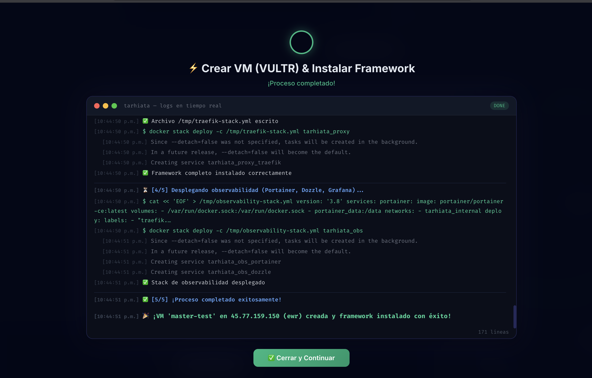

*Lee esta documentación en otros idiomas: [English](../../README.md), [Español](README.md)*

# ⚡ Tarhiata-Ops (PaaS Privado 100% Stateless & Local-First)


-orange?style=for-the-badge)


**Tarhiata-Ops** es un plano de control y PaaS (Plataforma como Servicio) privado de consumo cero (0 MB RAM en servidor), diseñado para desplegar, orquestar y observar microservicios, bases de datos y clústeres multi-nodo en tu propio servidor VPS.

Obtén la velocidad, estética y experiencia de desarrollador (UX) de Vercel y Railway, pero ejecutándose 100% en tu propia infraestructura con total soberanía de datos y cero costos mensuales de suscripción.

<p align="center">
  
  <br><br>
  
</p>

---

## 📥 Descargas Directas Pre-Compiladas (Versión Beta)

Descarga el ejecutable pre-compilado listo para usar en tu sistema operativo sin necesidad de compilar código:

- 🍏 **macOS (Apple Silicon M1/M2/M3/M4):** [`tarhiata-darwin-arm64`](https://github.com/Dall06/tarhiata-ops/releases/latest/download/tarhiata-darwin-arm64)
- 🍎 **macOS (Intel):** [`tarhiata-darwin-amd64`](https://github.com/Dall06/tarhiata-ops/releases/latest/download/tarhiata-darwin-amd64)
- 🐧 **Linux (x86_64 / amd64):** [`tarhiata-linux-amd64`](https://github.com/Dall06/tarhiata-ops/releases/latest/download/tarhiata-linux-amd64)
- 🐧 **Linux (ARM64 / Raspberry Pi):** [`tarhiata-linux-arm64`](https://github.com/Dall06/tarhiata-ops/releases/latest/download/tarhiata-linux-arm64)
- 🪟 **Windows (x64):** [`tarhiata-windows-amd64.exe`](https://github.com/Dall06/tarhiata-ops/releases/latest/download/tarhiata-windows-amd64.exe)

---

## 🏛️ Filosofía de Arquitectura

1. **100% Stateless en el Host VPS (Cero Sobrecarga de RAM):**
   * A diferencia de otros PaaS pesados que consumen entre 500 MB y 2 GB de RAM en tu servidor instalando agentes, Tarhiata-Ops corre **100% en tu computadora local**.
   * El 100% de la memoria RAM y CPU de tu VPS queda estrictamente reservado para tus aplicaciones y bases de datos.
2. **Local-First & Control Directo por SSH:**
   * Sin servidores intermediarios en la nube, sin telemetría y sin exponer webhooks entrantes al internet público.
   * La comunicación se realiza mediante túneles cifrados SSH directo a tu servidor.
3. **Sincronización de Estado Resiliente Multi-PC:**
   * La topología del clúster se auto-exporta a referencias no sensibles (`/opt/tarhiata/state.json`) en tu VPS.
   * Conectarte desde una laptop o PC nueva importa automáticamente todo el catálogo del clúster al instante.
4. **Buildpacks Zero-Config & Auto-Detección:**
   * Auto-detecta `Dockerfile`, `package.json`, `go.mod` o `requirements.txt` para construir y desplegar aplicaciones sin fricción de configuración.

---

## ✨ Características Principales

- **🌐 Control Plane Web con Estética Vercel/Railway (`http://localhost:8080`):**
  - Paleta de comandos Spotlight (`⌘K` / `Ctrl+K`) para navegación rápida por teclado.
  - Grafo topológico SVG en tiempo real, métricas cgroups, logs en vivo y terminal SSH interactiva.
- **🗄️ Motores de Base de Datos y Almacenamiento 1-Click:**
  - Aprovisionamiento instantáneo para **PostgreSQL**, **MongoDB**, **MySQL**, **Redis** y **MinIO (Object Storage S3)**.
  - Modo Recuperación (retención de volumen host en `/opt/data/db-*`) que previene pérdida accidental de datos.
- **🚀 Despliegues Rolling Updates Zero-Downtime:**
  - Gestión automática de certificados SSL HTTPS con Traefik v3 (Let's Encrypt / ZeroSSL).
  - Actualizaciones progresivas `start-first` en Swarm con rollback automático si falla el despliegue.
- **🔑 Control de Acceso por Llaves SSH para Equipos:**
  - Gestión de llaves SSH de desarrolladores en caliente (`tarhiata ssh-key`). Agrega y revoca accesos con **Protección de Cuenta Maestra Vultr** (evitando la eliminación accidental de llaves del servidor).
- **🏗️ Escalamiento Multi-Nodo vía Vultr API v2:**
  - Aprovisionamiento automatizado con Terraform para nodos worker dedicados, con región por defecto en **Ciudad de México (`mex`)**.
- **📦 Exportador de Respaldos S3 Personalizable:**
  - Copias de seguridad de BDs y volúmenes a almacenamiento local (`/opt/tarhiata/backups`) o directamente a **MinIO S3** o proveedores externos (**Cloudflare R2**, **AWS S3**, **DigitalOcean Spaces**, **Wasabi**).
- **📜 Registro de Auditoría NDJSON Inmutable:**
  - Historial local inmutable de eventos de seguridad, despliegues, vinculación de servicios y cambios en el clúster.

---

## ☁️ Proveedores de Infraestructura en la Nube Soportados

- [x] 🟢 **Vultr** *(100% Cubierto y Soportado - API v2, Región México `mex` por defecto y selección de planes)*
- [ ] ⏳ **DigitalOcean** *(Planificado / Hoja de ruta)*
- [ ] ⏳ **Hetzner Cloud** *(Planificado / Hoja de ruta)*
- [ ] ⏳ **AWS EC2** *(Planificado / Hoja de ruta)*
- [ ] ⏳ **Linode / Akamai** *(Planificado / Hoja de ruta)*

> ℹ️ **Nota:** Actualmente **Vultr** es el único proveedor completamente cubierto e implementado al 100% para el aprovisionamiento automatizado de nodos worker y selección de planes en la nube. ¡Otros proveedores se integrarán en futuras versiones!

---

## 🖥️ Soporte para Servidores VPS Existentes vs. Automatización Cloud

¡Tarhiata-Ops funciona **100% con cualquier VPS existente o servidor dedicado** (Ubuntu/Debian) que ya tengas contratado previamente en cualquier proveedor!

| Funcionalidad / Capacidad | VPS Existente (Cualquier Proveedor / Self-Hosted) | Integración Cloud Automatizada (Vultr API) |
| :--- | :---: | :---: |
| **Despliegues Zero-Downtime (`tarhiata deploy`)** | ✅ 100% Soportado | ✅ 100% Soportado |
| **Bases de Datos 1-Click & MinIO S3 (`db create`)** | ✅ 100% Soportado | ✅ 100% Soportado |
| **Enrutamiento SSL HTTPS & Traefik v3** | ✅ 100% Soportado | ✅ 100% Soportado |
| **Variables .env, Link/Unlink, Explorador de Volúmenes** | ✅ 100% Soportado | ✅ 100% Soportado |
| **Gestión de Llaves SSH y Logs de Auditoría** | ✅ 100% Soportado | ✅ 100% Soportado |
| **Aprovisionamiento Automático de Workers (`worker add`)** | ⚠️ Fallback a Nodo Único / Manager | ✅ Automatizado con Terraform |
| **Selección Dinámica de Planes y Escalamiento de VMs** | ⚠️ Gestionado manualmente en tu VPS | ✅ Automatizado vía API v2 |

> 💡 **Modo VPS Independiente:** Si conectas un VPS existente sin configurar un Token de API de Nube, Tarhiata-Ops funciona en **Modo Anclado a Manager**—¡dándote control total de despliegues, bases de datos, SSL y respaldos sin requerir permisos API en la nube!

---

## 🛠️ Instalación y Arranque Rápido

### Requisitos Previos
- **Go 1.25+** instalado en tu computadora local.
- Un VPS virgen (Ubuntu 22.04 / 24.04 recomendado) con acceso root por SSH.

### Ejecución Local
```bash
# Clonar el repositorio
git clone https://github.com/Dall06/tarhiata-ops.git
cd tarhiata-ops

# Iniciar el Web Dashboard (Spotlight ⌘K activo)
go run cmd/tarhiata/main.go
# Abre automáticamente http://localhost:8080
```

### Instalación Global
```bash
go build -o bin/tarhiata cmd/tarhiata/main.go
sudo mv bin/tarhiata /usr/local/bin/tarhiata
```

---

## 📖 Referencia de Comandos CLI

```text
Tarhiata-Ops PaaS - CLI & Control Plane

Uso:
  tarhiata [comando] [opciones]

Comandos disponibles:
  (sin comando)      Inicia el Web Dashboard en http://localhost:8080 (Spotlight Cmd+K)
  dashboard | ui     Inicia el Web Dashboard en http://localhost:8080
  config set         Configura credenciales SSH y Token de Vultr API Key
  init | bootstrap   Ejecuta InitServerUseCase (Docker Swarm + Traefik HTTPS + Fail2Ban)
  deploy             Despliega una app service en Swarm con SSL y Traefik
  preview            Gestiona entornos temporales efímeros (create/list/destroy)
  db create          Despliega una base de datos (PostgreSQL, Mongo, MySQL, Redis, MinIO S3)
  backup             Crea, lista o restaura snapshots de BD y Volúmenes (create/list/restore)
  env                Gestión masiva de variables de entorno .env (list/import/export/set)
  volume             Explorador de volúmenes persistentes /opt/data (ls/cat/rm)
  link               Conecta 2 servicios inyectando la URL/IP del destino en una Env Var
  unlink             Elimina la relación A ➔ B y remueve la Env Var en Swarm
  node               Gestiona nodos de Docker Swarm (ls/token/add/rm/update)
  worker add         Provisiona un nuevo worker node en Vultr vía Terraform
  master             Inicializa un servicio 1-Click All-in-One (desvincula anteriores, crea BD y conecta Env Var)
  rollback           Revierte un servicio Docker Swarm a su versión previa (docker service rollback)
  obs deploy         Despliega el stack de observabilidad (Portainer, Loki, Grafana)
  ssh-key            Gestiona llaves SSH autorizadas (ls/add/rm con protección Vultr)
  update             Actualiza paquetes del sistema y Docker daemon
  list               Lista todos los servicios y bases de datos registrados
  status             Muestra la salud del servidor y del clúster
  topology           Muestra el grafo de dependencias y rutas DNS del clúster
  prune              Limpia imágenes y volúmenes obsoletos en el VPS
```

---

## 🔐 Seguridad y Buenas Prácticas en Producción

- **Cero Puertos de Bases de Datos Expuestos:** Las bases de datos corren estrictamente dentro de redes `overlay` privadas de Swarm (`tarhiata_internal`) inalcanzables desde el internet público.
- **Integración con Fail2Ban y UFW:** Configurado automáticamente al ejecutar `tarhiata init` para bloquear ataques de fuerza bruta SSH.
- **Almacenamiento SQLite Local:** El estado local se almacena en `~/.config/tarhiata/config.db`.
- **Protección de Llaves Maestras:** Las llaves SSH maestras y credenciales de Vultr no pueden eliminarse desde la interfaz o CLI.

---

*Hecho con ❤️ para dominar la infraestructura con cero sobrecarga directamente desde tu terminal y panel web.*
